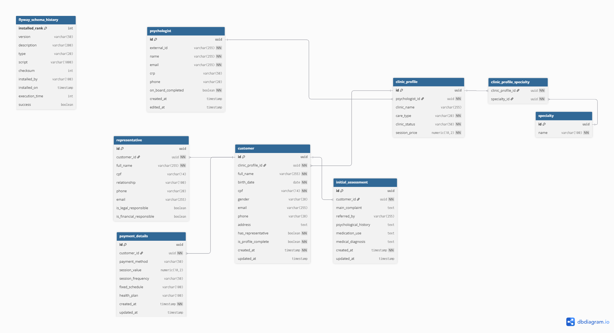

# 🧠 PsicoApp – Database Schema

This project uses a relational database with entities organized by domain, reflecting the structure of a modern psychology clinic system. It supports psychologists, clinic profiles, patient records, clinical assessments, and financial data.

---

## 🧩 Core Database Structure

- **Psychologist**: Represents the professional authenticated via Keycloak.
- **ClinicProfile**: Stores clinic-level data such as name, care type, session price, and specialties.
- **Specialty**: Lists clinical specialties (e.g., CBT, Neuropsychology).
- **Patient**: Represents the client/patient associated with a clinic.
- **Representative**: Legal or financial representative of a patient.
- **InitialAssessment**: Stores the initial clinical evaluation data.
- **PaymentDetails**: Stores session pricing, frequency, and payment method.

---

## 📊 How to Render the Diagram in dbdiagram.io

1. Visit [https://dbdiagram.io](https://dbdiagram.io)
2. Click "New Diagram"
3. Paste the `database.dbml` schema code into the editor
4. Click "Save" and explore the interactive ER diagram

> Tip: You can export the diagram as a PNG or share a public link with your team.

---

## 🖼️ Visual Diagram 

---

