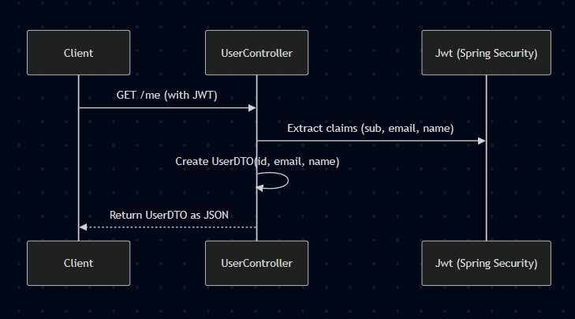

## GET - /me

### **Diagram:**




### [Mermaid](https://mermaid.live/edit#pako:eNqNkl9rwjAUxb9KuE8KndNqbZsHX1QGwiZMx2D0JWvvaliTdrcJ6sTvvtjOgfsDy1Nucs4vJ8k9QFpmCBxqfLOoU5xJkZNQiWZuVIKMTGUltGHTQqI2P9cfaqRpqQ2VRYH0c3-xNayzqkjqnK0wtSTNvpvoVthCryaTSwpnN_M1u1bIOltpNmzxuO62hkudM_6K52y-MyRSw9JCSFWzTm2fPYZKyMJjWij8C_c9x5RQGGx0s_WyI7N_UBymvRdn92gs6bOdiZotVsu7RIMHOckMuCGLHigkB3UlHE7EBMwGFSbA3TQT9JpAoo_O4x70qSzV2UalzTfAX0RRu8pWmYv6-X9fEtTZKZzVBvhgMGgYwA-wAx4FvVEYBMEo8qN-5MdjD_ZOFMe9YTiK_TAeDyM_GB89eG8O7feiMPAAM2lKum3bpume4weyssAR)  code: 
```
    sequenceDiagram
    participant Client
    participant UserController
    participant Jwt (Spring Security)

    Client->>UserController: GET /me (with JWT)
    UserController->>Jwt (Spring Security): Extract claims (sub, email, name)
    UserController->>UserController: Create UserDTO(id, email, name)
    UserController-->>Client: Return UserDTO as JSON

```